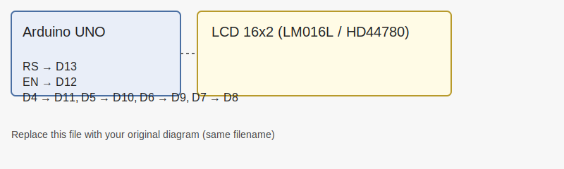

# SIMULINO UNO — Arduino UNO + LCD (LM016L)

This repository demonstrates an Arduino UNO driving a 16x2 character LCD
(LM016L / HD44780-compatible). The sketch prints a static message on the
first line and a seconds counter on the second line so the display updates
during simulation or on real hardware.

All documentation is consolidated here in this `README.md` (no separate
`docs/` files). The image above is loaded from `assets/Graphic.SVG` — replace
that file with your preferred diagram (same filename) to have it display.

Files
- `sketch_mar17a.ino` — Arduino sketch used by the project.

Bill of Materials (BOM)
- Arduino UNO (or ATmega328P on breadboard)
- LCD 16x2 (LM016L or any HD44780-compatible)
- 10 kΩ potentiometer (contrast)
- 220 Ω resistor (optional backlight current limit)
- Jumper wires, breadboard, +5V power source

Wiring (LCD pins to Arduino pins)

- LCD RS  -> Arduino D13
- LCD EN  -> Arduino D12
- LCD D4  -> Arduino D11
- LCD D5  -> Arduino D10
- LCD D6  -> Arduino D9
- LCD D7  -> Arduino D8
- LCD VSS -> GND
- LCD VDD -> +5V
- LCD VO  -> Pot wiper (10K) between +5V and GND
- LCD A   -> +5V through 220Ω (backlight +)
- LCD K   -> GND (backlight -)

How to use (real hardware)
1. Wire the LCD as shown above.
2. Open `sketch_mar17a.ino` in the Arduino IDE.
3. Select `Tools > Board > Arduino/Genuino UNO` and correct COM port.
4. Upload the sketch. The LCD should show "Hello, World!" and an increasing
   seconds counter on the second line.

Proteus / Simulation Notes
- Use a generic 16x2 LCD component (HD44780) if LM016L is not listed.
- To run in Proteus, export the compiled HEX from the Arduino IDE via
  `Sketch > Export compiled Binary` and load that HEX into the Arduino UNO
  or ATmega328P component's Program File property.

Troubleshooting
- Blank display: check contrast pot wiring (VO). Try adjusting the pot.
- Garbage characters: confirm RW pin on LCD is tied to GND.
- Backlight off: ensure A/K pins and resistor are wired correctly.
- In Proteus, if the LCD doesn't show text, try toggling contrast or using
  the Arduino UNO model which handles bootloader/pins more conveniently.

License
- MIT — feel free to reuse and modify. Attribution appreciated.
